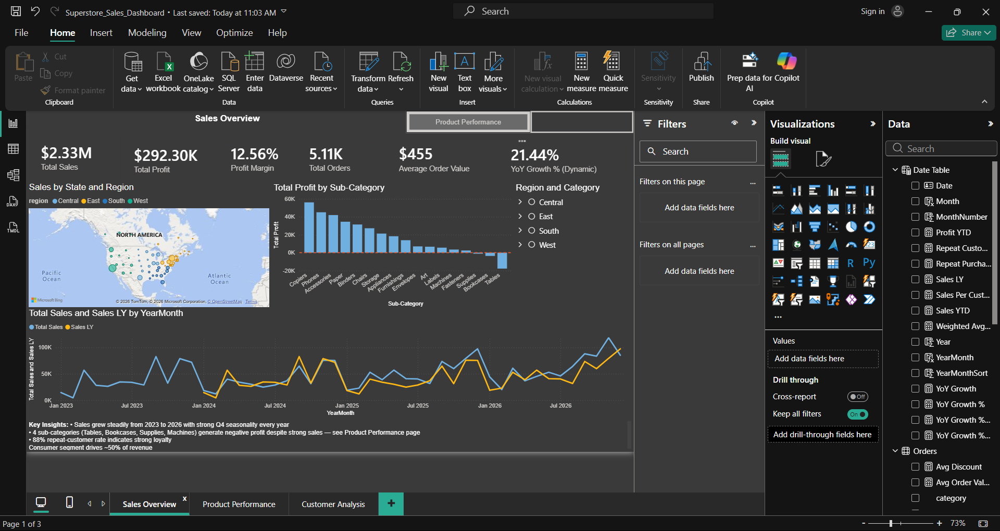
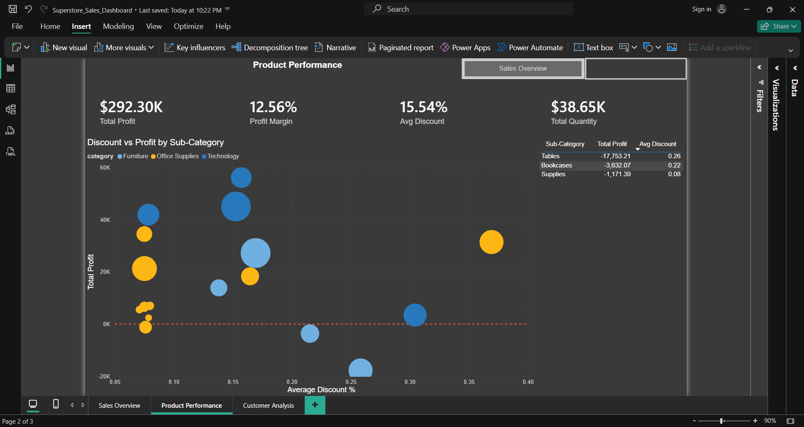
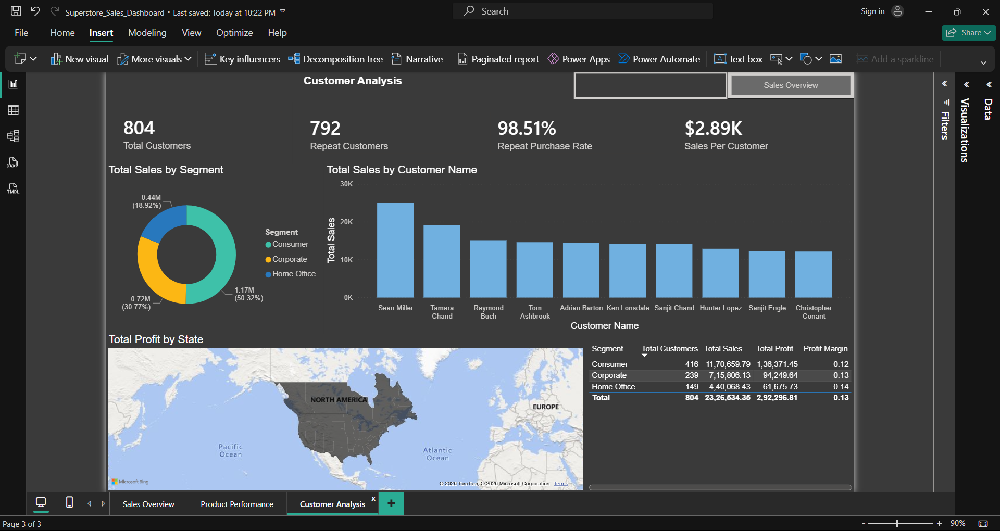

# Superstore Sales & Performance Dashboard

This dashboard surfaced ~$22.5K in annual losses driven by aggressive 
discounting in 3 sub-categories — and quantifies a $25–30K profit recovery 
opportunity from capping discounts at 15%. Built in Power BI with DAX time 
intelligence, customer segmentation, and dynamic year-over-year comparison 
across 3 report pages.

📁 Download the `.pbix` file above to open in Power BI Desktop, or scroll 
down for full screenshots of each page.

---

## Project Overview

Built using the Sample Superstore dataset (~10,000 retail transactions). 
The dashboard answers four key business questions:

1. How is the business performing overall?
2. Which products and regions drive sales?
3. Why do some sub-categories lose money despite strong sales?
4. Who are our most valuable customers?

*Note: Dataset dates rescaled to 2023–2026 to match recent timeframes for 
portfolio relevance. Year-over-year trends reflect dataset structure, not 
real market conditions.*

## Tools & Techniques

- **Power BI Desktop** — data modeling, multi-page report design, cross-page navigation
- **DAX time intelligence** — `SAMEPERIODLASTYEAR` for YoY comparison with a 
  dedicated marked Date table
- **Dynamic measures** — `HASONEVALUE` + `SELECTEDVALUE` pattern for 
  slicer-aware YoY % that defaults to latest year
- **Custom DAX measures** — Total Profit, Profit Margin, Average Order Value, 
  Repeat Purchase Rate, YoY Growth %, Sales per Customer, Weighted Avg Discount
- **Interactive elements** — region/category slicers, year slicer, page 
  navigation buttons, cross-filtering between visuals

## Dashboard Pages

### Page 1 — Sales Overview
Top-line KPIs (Total Sales, Profit, Margin, Orders, AOV, YoY Growth), US 
geographic distribution, profit by sub-category, and a year-over-year trend 
chart comparing current sales against the same period last year. YoY % is 
slicer-driven and defaults to the latest fiscal year.

### Page 2 — Product Performance
A discount-vs-profit scatter plot identifying the relationship between 
aggressive discounting and negative profit. Tables, Bookcases, and Supplies 
are flagged as loss-making sub-categories despite generating strong sales 
volume.

### Page 3 — Customer Analysis
Customer segmentation by Consumer / Corporate / Home Office, repeat-purchase 
behavior, top 10 customers by sales, and geographic profit at the state level.

## Key Insights

- **$2.33M total sales, $292K profit (12.5% margin)** with 21.4% YoY revenue 
  growth (FY26 vs FY25) and consistent Q4 holiday seasonality.
- **3 sub-categories generate combined annual losses of ~$22.5K** despite 
  strong sales volume:
  - Tables: −$17.7K (avg discount 26%)
  - Bookcases: −$3.6K (avg discount 22%)
  - Supplies: −$1.2K (avg discount 8%)
- **Root cause:** Aggressive discounting on Tables and Bookcases wipes out 
  margin entirely.
- **Recommendation:** Cap discounts at 15% on Tables, Bookcases, and 
  Supplies. Based on the data, this could shift roughly $25–30K from 
  negative to positive annual profit.
- **Customer behavior:** Consumer segment drives ~50% of total revenue; 
  a meaningful portion of customers placed 3+ orders, indicating strong 
  purchase frequency among the core customer base.

## Files in This Repository

- `Superstore_Sales_Dashboard.pbix` — Power BI source file
- `Sample_Superstore.csv` — raw dataset
- `sales_overview.png`, `product_performance.png`, `customer_analysis.png` — page screenshots

## How to Use

1. Download the `.pbix` file
2. Open with [Power BI Desktop](https://powerbi.microsoft.com/desktop/) (free)
3. Click through the three page tabs to explore each section
4. Use the slicers (Region, Category, Year) to drill into specific dimensions

## Limitations & Notes

- Sample Superstore is a learning dataset; real-world data would include 
  returns, refunds, customer churn, and longer cohort behavior not modeled here.
- The dataset is sampled toward repeat customers, so loyalty metrics should 
  be interpreted within that context.
- Date range rescaled to 2023–2026 for portfolio relevance — actual dataset 
  spans a different historical period.
- The "Recommendation" figures are directional estimates based on the 
  observable data, not validated against external benchmarks.

## About

Built by **Chitra Varma** — B.Sc Computer Science Graduate from Pillai 
HOC College, building a portfolio in data analytics and business intelligence.

🔗 LinkedIn: https://www.linkedin.com/in/chitra-varma-12aa28323/  
📧 chitravarma.cyv@gmail.com
